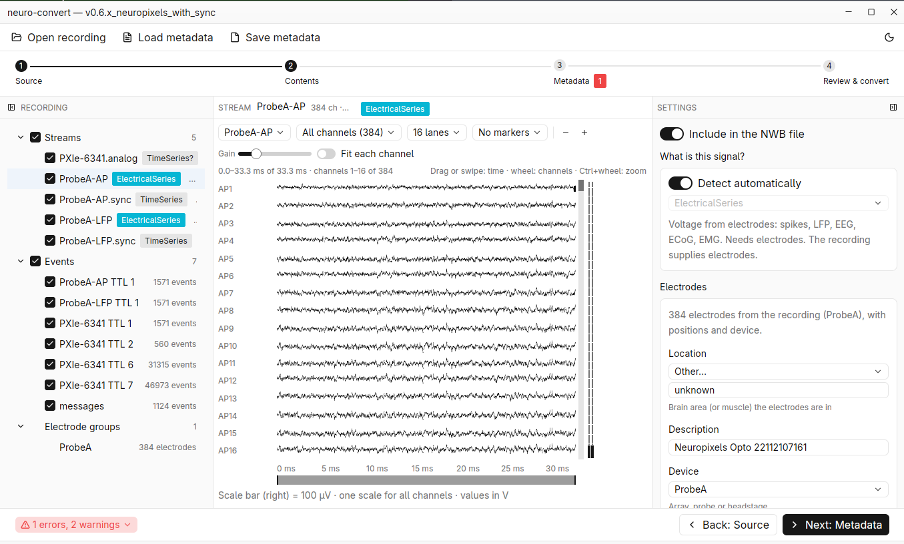

# neuro-convert

> **Under development.** neuro-convert is available for testing and not ready for production use.
> Expect changes to the command line, the metadata file, the output and the API between versions.

Converts neurophysiology recordings to [NWB](https://nwb.org) 2.11, as a Zarr store
(`.nwb.zarr`) or an HDF5 file (`.nwb`). Command line and desktop app, written in Rust.



- **Streaming.** Recordings are memory-mapped and copied in blocks; multi-hour recordings never sit
  in memory.
- **Exact values.** Samples keep their stored integer type; gains are written as NWB `conversion`
  / `channel_conversion`.
- **Verified output.** After writing, the data in the file is read back and compared with the
  source (xxh3-64 per block). The digests go to `<output>.report.json`; `neuro-convert verify`
  re-checks a copy against them without the source.
- **Compared readers.** Each reader is compared value for value with a reference reader (neo,
  TDT's `tdt` package, SpikeGLX's conversion rules, probeinterface) on public test data, through
  the whole pipeline.
- **Traceable.** The program, reader and crate versions are recorded in the report and in the
  NWB file (`/general/source_script`).

Documentation: <https://neuro-kitchen.github.io/neuro-convert/> (sources in [`docs/`](docs/introduction.md),
an mdBook; `mdbook serve docs` to read it locally). API reference: `cargo doc --no-deps --workspace --exclude nc-app --open`.

## Supported formats

| Input | Versions | Open |
|---|---|---|
| TDT | Synapse and OpenEx; TEV and SEV v0–v3 | block folder, or tank with `--block` |
| SpikeGLX | Neuropixels 3A, 1.0 family, 2.0; NI-DAQ; OneBox; multi-trigger gates, CatGT `_tcat` | run folder, `.bin` or `.meta` |
| Intan | RHD and RHS 1.0–3.x; one file, one file per signal type, one file per channel | `.rhd` / `.rhs` file or RHX folder |
| Open Ephys | Binary format, GUI 0.4.4–0.6+; legacy `.continuous` (GUI ≤ 0.4) | save folder, record node or recording folder |
| Blackrock | NSx / NEV file spec 2.1–3.0, PTP timestamps | folder or any file of the recording |
| Neuralynx | Cheetah 1–6, Pegasus 2, BML, Neuraview | session folder or any file in it |

| Output | Layout | Read with |
|---|---|---|
| NWB 2.11, Zarr v3 (`-o name.nwb.zarr`) | hdmf-zarr's | pynwb + hdmf-zarr ≥ 0.14, DANDI |
| NWB 2.11, HDF5 (`-o name.nwb`) | pynwb's | pynwb, h5py; needs a build with HDF5 |

Both outputs cache the NWB schema in the file.

Per format: what is read, how it maps to NWB, and where it differs from the reference reader —
[`docs/formats/`](docs/formats/). Reader maturity and tested tool versions —
[`docs/compatibility.md`](docs/compatibility.md). How the model becomes NWB —
[`docs/outputs/nwb-mapping.md`](docs/outputs/nwb-mapping.md).

Not supported yet: probe library and headstage wiring; joining Intan time-split files; Open Ephys
binary-format spikes; Plexon, Spike2 and other formats.

## Build

Rust 1.85 or later (edition 2024).

```sh
cargo build --release -p nc-cli                         # CLI, Zarr output
cargo build --release -p nc-cli --features hdf5-static  # + HDF5 output, HDF5 built from source (cmake, C compiler)
cargo build --release -p nc-cli --features hdf5         # + HDF5 output, system HDF5 (hdf5-devel / libhdf5-dev)
cargo build --release -p nc-app --features hdf5-static  # desktop app
```

Binaries: `target/release/neuro-convert`, `target/release/neuro-convert-app`.

The app links against system libraries (xcb, xkbcommon, fontconfig, freetype, Wayland) and needs
Vulkan at run time. Fedora:

```sh
sudo dnf install libxcb-devel libxkbcommon-devel libxkbcommon-x11-devel fontconfig-devel freetype-devel wayland-devel vulkan-loader
```

`scripts/release.sh` builds the CLI with HDF5 and packs it with the docs and example metadata into
`dist/neuro-convert-<version>-<target>.tar.gz`. The app is not released yet.

## Usage

```sh
neuro-convert formats                                   # readers and versions in this build
neuro-convert inspect <recording>                       # streams, events, electrodes, warnings
neuro-convert convert <recording> -m meta.yaml -o out.nwb.zarr --dry-run   # show the plan and its issues
neuro-convert convert <recording> -m meta.yaml -o out.nwb.zarr
neuro-convert validate out.nwb.zarr                     # NWB structure
neuro-convert verify out.nwb.zarr                       # structure + content against the report
```

| Option | Use |
|---|---|
| `--block <name>` | choose one recording in a folder that holds several (tank block, gate, segment) |
| `--only A,B` | read only these streams |
| `--sort <id>` | TDT offline spike sort |
| `--verify full\|sampled\|off` | content check after writing (CLI default `full`) |
| `--skip-source-check` | convert even when the source file's own checksum (SpikeGLX `fileSHA1`) fails |

Ctrl-C stops a conversion and removes the partial output.

### Metadata file

A recording does not store everything NWB needs (session description, subject species and age,
time zone, electrode locations), nor how each stream should be exported. `meta.yaml` supplies
both. Its keys are the recording's own stream and store names. Start from
[`metadata/session.example.yaml`](metadata/session.example.yaml); real examples are in
[`metadata/examples/`](metadata/examples/). `--dry-run` lists blocking errors and missing DANDI
fields.

### App

The app runs the same conversion in four steps: Source, Contents, Metadata, Review & convert. It
previews the data, and saves and loads the same metadata YAML as the CLI. Its default check after
writing is `sampled`. Guide: [`docs/app.md`](docs/app.md).

## Repository

```
crates/
  base/        nc-base       errors, sample types, decoding, memory maps, text, ISO time
  core/        nc-core       neutral data model (Session), Reader trait, metadata file
  readers/     nc-<format>   one crate per input format
  nwb/         nc-nwb        NWB writer: plan, Zarr and HDF5 backends, validation, content check
  convert/     nc-convert    API for the CLI and the app: reader registry, conversion Job
  cli/         nc-cli        the `neuro-convert` command
  app/         nc-app        the desktop app
docs/          format pages, NWB mapping, app guide, reader guide, compatibility
templates/     starting point for a new reader
metadata/      metadata template and examples
tools/python/  reference comparisons, NWB read-back, test data download
scripts/       release build
packaging/     Linux desktop entry
```

Dependencies point one way: `cli, app → convert → readers, nwb → core → base`. Readers do not
know NWB; the NWB writer does not know any reader. A reader produces a `Session`; everything after
it (metadata, NWB plan, writing, verification, the app) works for every format.

`cargo build` and `cargo test` skip `nc-app` (GPUI is a large build); use `-p nc-app`.

## Adding or changing a reader

1. Copy `templates/reader/` to `crates/readers/<format>/` and implement `nc_core::Reader`.
2. Register it: a feature in `nc-convert`, `nc-cli` and `nc-app`, one line in
   `Registry::builtin()`, the crate in `nc_convert::versions()`.
3. Test it on a synthetic fixture and real data, add a reference comparison under
   `tools/python/compare/`, write `docs/formats/<format>.md`.

Mapping rules every reader follows, known traps and the definition of done:
[`docs/readers/README.md`](docs/readers/README.md). A reader can also live in its own crate,
outside this repository: `nc_convert::Registry::builtin().with(MyReader)`.

Every crate has its own version and `CHANGELOG.md`. A change in what a reader reads or how it maps
is a version bump with a changelog entry. Breaking changes to `nc-core` are deprecated one release
ahead ([`docs/compatibility.md`](docs/compatibility.md)).

## Tests

```sh
cargo test                                      # all crates except the app
cargo test -p nc-app                            # the app (headless UI tests)
python3 tools/python/fetch_gin.py --all         # public test data → data/raw/
python3 tools/python/fetch_gin.py --check       # local test data against tools/python/testdata.toml
cargo build --release && uv run --no-project --with neo --with pynwb --with hdmf-zarr \
    --with tdt --with probeinterface python tools/python/compare <format> <path>... [--hdf5]
```

Tests that need real recordings read `data/raw/` (or `$NC_DATA_DIR`) and skip when it is absent.
`compare` converts each data set, reads the NWB file back with pynwb and compares it with the
reference reader; `--hdf5` goes through the HDF5 writer.

## License

Licensed under either of [Apache License 2.0](LICENSE-APACHE) or [MIT](LICENSE-MIT), at your option.
